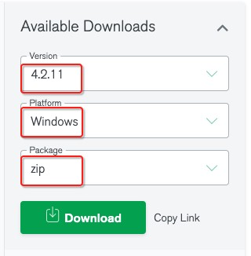
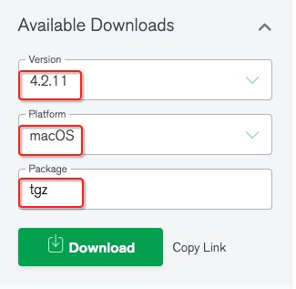
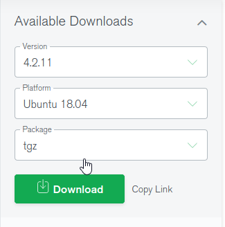

# 使用 windows 10 打包 windows 安装包

## 环境准备

### 安装 node-v12

下载并安装 [node-v12](https://nodejs.org/download/release/v12.19.1/node-v12.19.1-x64.msi)

安装完成之后打开命令提示符安装 **yarn**：

```bash
npm install -g yarn
```

国内用户配置[淘宝 NPM 镜像](https://developer.aliyun.com/mirror/NPM)以提高 NPM 包下载速度：

```bash
npm config set registry https://registry.npm.taobao.org
yarn config set registry https://registry.npm.taobao.org
```

### 下载 mongodb 免安装压缩包

下载 [mongodb 压缩包](https://www.mongodb.com/try/download/community)，按下图选择对应版本：



## 打包步骤

安装 pkg 工具， 执行 `npm install -g pkg`， github 地址为`https://github.com/vercel/pkg`，有详细使用说明

安装好 pkg 之后，在当前目录安装项目依赖包，执行 `yarn --prod`

依赖包安装好之后，开始打包，执行`yarn pkg-win`，具体脚本可在 **package.json** 的 **scripts** 中查看即`pkg . --options max_old_space_size=4096 --out-path=../../pkg/dist/ --targets node12-win-x64`

进入打包生成的执行程序目录，即 `--out-path=../../pkg/dist/`目录，将**steedos-project-mini.exe** 改名为**2-启动华炎魔方.exe**后，目录结构应为：

- `bin` 存放系统依赖的执行程序
  - `mongodb` 免安装压缩包解压后文件夹
- `db` 存放数据库数据
- `node_modules` 存放系统运行所需二进制包
  - `bcrypt`
  - `fibers`
  - `node-expat`
  - `node-notifier`
  - `open`
  - `opn`
- `steedos-packages` 存放安装的插件，如`steedos-app-crm.package`等`.package`后缀的文件
- `storage` 存放系统中上传的文件
- `.env` 是系统的配置文件可在此文件中配置端口、访问地址等
- `1-启动数据库.bat` 用于启动数据库服务，可双击启动数据库
- `2-启动华炎魔方.exe` 用于启动华炎魔方服务，可双击启动华炎魔方
- `steedos-config.yml` 配合.env 文件使用的配置文件
- `安装说明.docx` 系统安装及启动流程说明
- `使用说明.docx` 系统使用说明

**dist** 文件夹用于测试，同层级新建文件夹 **steedos-project-mini-win** 与 **dist** 具有同样的目录结构用于打包成 **steedos-project-mini-win-{steedos-server 版本号}.zip** 压缩包，并上传至阿里云 **/server-backups/steedos-platform/quick-installers/** 下，上传之后设置文件权限为只读，供用户下载

# 使用 macos 打包 macos 安装包

## 环境准备

### 安装 node-v12

下载并安装 [node-v12](https://nodejs.org/download/release/v12.19.1/node-v12.19.1.pkg)

安装完成之后打开终端安装 **yarn**：

```bash
npm install -g yarn
```

国内用户配置[淘宝 NPM 镜像](https://developer.aliyun.com/mirror/NPM)以提高 NPM 包下载速度：

```bash
npm config set registry https://registry.npm.taobao.org
yarn config set registry https://registry.npm.taobao.org
```

### 下载 mongodb 免安装压缩包

下载 [mongodb 压缩包](https://www.mongodb.com/try/download/community)，按下图选择对应版本：



## 打包步骤

安装 pkg 工具， 执行 `npm install -g pkg`， github 地址为`https://github.com/vercel/pkg`，有详细使用说明

安装好 pkg 之后，在当前目录安装项目依赖包，执行 `yarn --prod`

依赖包安装好之后，开始打包，执行`yarn pkg-macos`，具体脚本可在 **package.json** 的 **scripts** 中查看即`pkg . --options max_old_space_size=4096 --out-path=../../pkg/dist/ --targets node12-macos-x64`

进入打包生成的执行程序目录，即 `--out-path=../../pkg/dist/`目录，目录结构应为：

- `bin` 存放系统依赖的执行程序
  - `mongodb` 免安装压缩包解压后文件夹
- `db` 存放数据库数据
- `node_modules` 存放系统运行所需二进制包
  - `bcrypt`
  - `fibers`
  - `node-expat`
  - `node-notifier`
  - `open`
  - `opn`
- `steedos-packages` 存放安装的插件，如`steedos-app-crm.package`等`.package`后缀的文件
- `storage` 存放系统中上传的文件
- `.env` 是系统的配置文件可在此文件中配置端口、访问地址等
- `安装说明.docx` 系统安装及启动流程说明
- `使用说明.docx` 系统使用说明
- `1-启动数据库` 用于启动数据库服务，可双击启动数据库
- `2-启动华炎魔方` 用于启动华炎魔方服务，可双击启动华炎魔方
- `steedos-project-mini` 华炎魔方服务，由 pkg 打包生成
- `steedos-config.yml` 配合.env 文件使用的配置文件

**dist** 文件夹用于测试，同层级新建文件夹 **steedos-project-mini-macos** 与 **dist** 具有同样的目录结构用于打包成 **steedos-project-mini-macos-{steedos-server 版本号}.zip** 压缩包，并上传至阿里云 **/server-backups/steedos-platform/quick-installers/** 下，上传之后设置文件权限为只读，供用户下载

# 使用 ubuntu 18.04 打包 ubuntu 安装包

## 环境准备

### 安装 node-v12

添加 node 源：

```bash
curl -sL https://deb.nodesource.com/setup_12.x | sudo -E bash -
```

安装 make：

```bash
sudo apt-get install -y gcc g++ make
```

安装 node：

```bash
sudo apt-get install -y nodejs
```

检测是否安装成功：

```bash
steedos@ubuntu:~$ node -v
v12.17.0
```

> 打印出版本号即表示 node 安装成功

安装完成之后打开终端安装 **yarn**：

```bash
npm install -g yarn
```

国内用户配置[淘宝 NPM 镜像](https://developer.aliyun.com/mirror/NPM)以提高 NPM 包下载速度：

```bash
npm config set registry https://registry.npm.taobao.org
yarn config set registry https://registry.npm.taobao.org
```

### 下载 mongodb 免安装压缩包

下载 [mongodb 压缩包](https://www.mongodb.com/try/download/community)，按下图选择对应版本：



## 打包步骤

安装 pkg 工具， 执行 `sudo npm install -g pkg`， github 地址为`https://github.com/vercel/pkg`，有详细使用说明

安装好 pkg 之后，在当前目录安装项目依赖包，执行 `yarn --prod`

依赖包安装好之后，开始打包，执行`yarn pkg-linux`，具体脚本可在 **package.json** 的 **scripts** 中查看即`pkg . --options max_old_space_size=4096 --out-path=../../pkg/dist/ --targets node12-linux-x64`

进入打包生成的执行程序目录，即 `--out-path=../../pkg/dist/`目录，目录结构应为：

- `bin` 存放系统依赖的执行程序
  - `mongodb` 免安装压缩包解压后文件夹
- `db` 存放数据库数据
- `node_modules` 存放系统运行所需二进制包
  - `bcrypt`
  - `fibers`
  - `node-expat`
  - `node-notifier`
  - `open`
  - `opn`
- `steedos-packages` 存放安装的插件，如`steedos-app-crm.package`等`.package`后缀的文件
- `storage` 存放系统中上传的文件
- `.env` 是系统的配置文件可在此文件中配置端口、访问地址等
- `安装说明.docx` 系统安装及启动流程说明
- `使用说明.docx` 系统使用说明
- `1-启动数据库.sh` 用于启动数据库服务，可双击启动数据库
- `2-启动华炎魔方.sh` 用于启动华炎魔方服务，可双击启动华炎魔方
- `steedos-project-mini` 华炎魔方服务，由 pkg 打包生成
- `steedos-config.yml` 配合.env 文件使用的配置文件

**dist** 文件夹用于测试，同层级新建文件夹 **steedos-project-mini-linux** 与 **dist** 具有同样的目录结构用于打包成 **steedos-project-mini-linux-{steedos-server 版本号}.zip** 压缩包，并上传至阿里云 **/server-backups/steedos-platform/quick-installers/** 下，上传之后设置文件权限为只读，供用户下载
